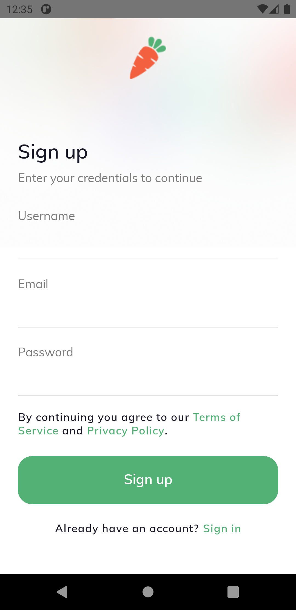

<h1 align="center">Online Groceries Shop</h1>

  
  
  
  
  
  
  

## :rocket: Knowledges
 - `React Native`
 - `Typescript`

## :paperclip: Useful Links
 - [Online Groceries Free App UI Kit for Figma](https://www.uistore.design/items/online-groceries-free-app-ui-kit-for-figma/)

## :book: How to use

To clone and run this application, you'll need [Git](https://git-scm.com/downloads) and [React Native](https://reactnative.dev/docs/getting-started) installed on your computer. From your command line:
